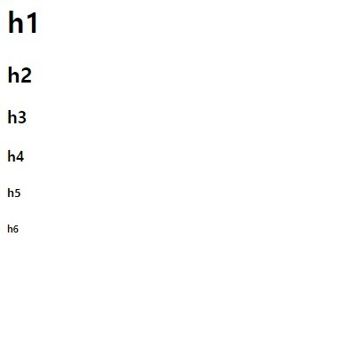
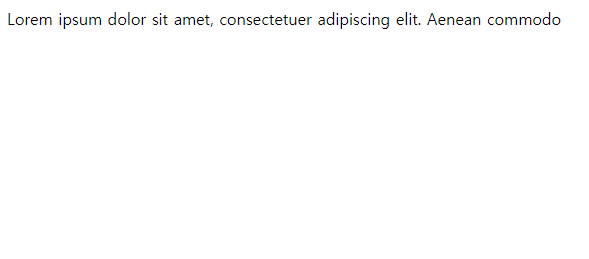
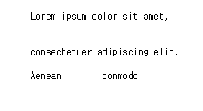
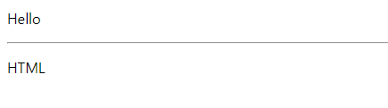

# HTML

## HTML이란?
HTML은 웹 페이지를 표현할 수 있는 마크업 언어이다. HTML 문서는 태그들로 이루어져 있다.

### 태그
```
<태그명 속성명="속성값">내용</태그명>
```
이는 태그의 형태이며, 내용의 앞을 **여는 태그**, 내용의 뒤를 **닫는 태그**라고 한다. 

여는 태그의 안쪽에는 해당 태그의 **속성**을 지정해 줄 수 있다. 예를 들어, 이미지를 넣는 태그일 때, 그 이미지를 불러오는 경로를 지정하는 속성 등을 사용할 수 있는 것이다. 속성은, 속성명 뒤에 같다(=)를 표시하고, 뒤에 큰따옴표(") 또는 작은따옴표(') 안에 속성을 지정하는 것이다. 위에서 들었던 이미지를 넣는 태그에서라면, 따옴표 안에는 해당 이미지의 경로가 들어갈 것이다. 

또한, 닫는 태그는 없는 경우도 있고, 여는 태그와 달리 속성을 작성할 수 없으며, 앞에 슬래쉬(/)가 붙는다.

종료 태그 없이 시작 태그만을 가지는 태그는 **빈 태그**라고 한다.
```
<여는태그 속성명="속성값"/>
```
처음 소개한 형태와는 다르지만, 여는 태그와 닫는 태그 사이에 내용이 존재하지 않는다면 이렇게도 표현할 수 있다.

```
<div>
  <p>Sohi</p>
</div>
```
중요한 특징 중의 하나로, 요소는 중첩될 수 있다. 요소 안에 다른 요소를 포함할 수 있다는 것이다. 대신, 여는 태그와 닫는 태그의 순서는 일치해야한다. div라는 태그 안에 div를 상위 태그로 사용했는데, 하위 태그를 열어두고 div 태그를 먼저 닫아버리면 에러가 발생한다. 

물론, HTML은 직접적으로 표현하는 언어는 아니다. 그러나 표현되지 않아도 잘못된 방식으로, 원하는 형태로 웹 페이지가 만들어지지 않을 수 있다.

### 작성
윈도우 기준으로 메모장 같은 기본 에디터로 작성할 수 있다. 메모장에 HTML 코드를 작성한 후에 확장자를 .txt가 아닌, .html로 수정해 저장하면 브라우저에서 확인이 가능하다. 

### 버전

1991년, 최초로 HTML이 발표된 이후로, 현재는 2014년에 발표된 HTML 5를 사용 중에 있다.

### 권장사항
- 각 태그는 소문자로 쓰는 것을 권장한다.
- 속성 명은 소문자로 쓰는 것을 권장한다.
- 속성 값은 큰따옴표를 쓰는 것을 권장한다.

## 기본 구조
```html
<!DOCTYPE html>
<html>
  
  <head>
    <title>문서 제목</title>
  </head>
  
  <body>
    <div>
      .
      .
      .
      .
      .
    </div>
  </body>

</html>
```
```<!DOCTYPE html>``` : 현재 문서가 HTML5 문서임을 명시한다.  
```<html>``` : 현재 문서의 Root 요소를 지정한다.
```<head>```: 문서의 메타데이터(문서에 대한 정보)를 정의하며, 브라우저에는 직접적으로 표시되지 않는다. `<title>`, `<style>`, `<meta>` 태그 등을 사용해 표현할 수 있다.
```<title>```: 해당 문서의 제목을 정의하며, 웹 브라우저 각 탭의 툴바에 표시되고 검색 엔진의 결과 페이지의 제목으로 표시되기도 한다.
```<body>```: 브라우저를 통해 보여지는 내용이다. 이 태그 안에는 ```<h1>, <p>, <div>```등의 태그를 통해 페이지의 구조를 잡는다.
 

## 기본 태그

### 텍스트 요소

#### 제목
HTML 문서에서 제목을 표현할 때, ```<h1>~<h6>``` 태그를 많이 사용한다. h1부터 h6 순서로 크기가 작아진다.

```html
<h1>h1</h1>

<h2>h2</h2>

<h3>h3</h3>

<h4>h4</h4>

<h5>h5</h5>

<h6>h6</h6>
```


`<h>` 태그를 통해 검색 엔진이 키워드를 파악하고, 검색 시 해당 글이 노출될 확률이 높아지기 때문에 중요하다.

### 단락
HTML 내에서 문단을 표시할 때 사용하는 태그는 `<p>`태그이다. `<p>`태그는 태그 내의 내용에 스페이스바로 여러 칸 띄어도, 엔터를 여러 줄 띄어도 한 번의 띄어쓰기로 표현된다.

```html
<p>
  Lorem ipsum dolor sit amet, 
  
  
  consectetuer adipiscing elit. 
  
  Aenean        commodo
</p>
```


만약 태그 내에 작성한 그대로 표현하고 싶다면, `<pre>`태그를 사용해야한다. `<pre>`는 작성한 내용 그대로 웹 브라우저에 나타난다.
```html
<pre>
  Lorem ipsum dolor sit amet, 
  
  
  consectetuer adipiscing elit. 
  
  Aenean        commodo
</pre>
```


내용을 구분할 때, 사용할 수 있는 수평 가로 구분선 태그는 `<hr>`태그이다. 이는 빈태그로, 닫는 태그가 없이 사용한다.
```html
<p>Hello</p>
<hr>
<p>HTML</p>
```


#### 텍스트 서식

텍스트를 굵은 글자로 표시해 강조할 수 있는 태그로 `<b>`태그와 `<strong>`태그가 존재한다. 두 태그 중 무엇을 사용하던 표현적으로는 차이가 없다. 그러나 `<b>`태그가 단지 화면상의 텍스트를 강조한다면, `<strong>`태그는 내용적인 측면에서도 강조시킨다는 것이다. 검색 엔진은 `<strong>`태그를 통해 해당 내용이 중요함을 인식한다는 차이점이 있다.

```html
<p>Hello</p>
<p><b>HTML</b></p>
<p><strong>Let's study!</strong></p>
```


